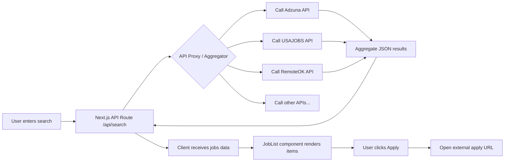

# Executive Summary

We surveyed **8+ public/free job-search APIs** to identify candidates for a worldwide job listing SPA. Each API is official (where possible) or well-documented, and provides JSON results with fields like title, company, location, etc.  Key findings:

- **Adzuna** – Global job aggregator with free tier (requires app_id/key, 25 req/min, 250/day). Supports many countries (e.g. /jobs/gb/, /jobs/us/). Returns title, company, location, salary, description snippet, apply URL, etc. Requires crediting Adzuna.
- **USAJOBS** – Official US federal jobs API (requires free API key). It returns rich data (title, agency, location, salary, dates, full description, application links). Pagination up to 10 000 results (max 500 per page) and well-documented stability (US government service).
- **Careerjet** – Global job search (UK-based). Requires an API key (Basic Auth). Returns title, company, location, date, description, salary range, URL. Pagination via `page` parameter; free for affiliate use.
- **Reed.co.uk** – UK job board API (UK jobs, requires API key). Provides search and job detail endpoints. Search returns job ID, employer, title, description snippet, location, salary, etc. Details endpoint adds salary breakdown, contract, apply URLs.
- **Arbeitnow** – Free European/remote job aggregator API (no key). Single endpoint returns all jobs (filter by `visa_sponsorship`). Fields include `slug`, `company_name`, `title`, `description`, `tags`, `job_types`, `location`, `remote` (bool), and `created_at`. No pagination (returns ~17K jobs); intended for small apps. CORS is allowed (no auth).
- **RemoteOK** – Free remote-only jobs feed (no key). JSON feed at `https://remoteok.com/api` (filter by `?tags=`). Returns jobs with `id`, `company`, `position` (title), `tags`, HTML `description`, `location`, `apply_url`, `salary_min/max`, etc. Requires credit/linkback to RemoteOK.
- **WorkingNomads** – Free remote job JSON feed (no key). `https://www.workingnomads.com/api/exposed_jobs/` returns an array of jobs. Each has `title`, `company_name`, `location`, `category_name`, `tags`, `description` (HTML), and `url` to apply. No search/filter parameters (static feed).
- **Findwork.dev** – Remote-focused dev/design jobs (requires API key). Provides `/api/jobs` (and companies, etc). Returns listings aggregated from sites like HN, Dribbble. Uses Bearer auth. CORS not supported.

The table below compares these APIs on key attributes (fields, auth, CORS, etc). Our **top 3 recommendations** for a global job-finder SPA are **Adzuna**, **USAJOBS**, and **RemoteOK**. Adzuna offers broad coverage (US/UK/Europe/Australia, etc.) with salary data, USAJOBS provides authoritative US postings, and RemoteOK yields many remote roles worldwide. These cover diverse use-cases and have liberal use policies (with crediting).

For the Next.js 15 SPA integration, we propose a single-page UI with a search bar (debounced input) and results list. Client-side code will call **Next.js API routes** that proxy external APIs (handling keys and CORS). Results will be cached in React state (or with SWR/React Query) to minimize calls. Error and empty-result states will be handled. Job “Apply” buttons will open the original job URLs (in a new tab).

We will use **PostgreSQL** (with Prisma) to store jobs, user saved searches, and submitted applications. Suggested tables/models include `Job`, `SavedSearch`, and `Application` (fields like title, company, location, description, applyUrl, etc.). Example Prisma schemas and migrations are provided.  

Server-side, Next.js API routes (or edge functions) will fetch from each job API. These routes will use server-stored API keys (if needed) and enforce rate-limits. The routes also record applications in the database. Sample TypeScript code demonstrates fetching and Prisma usage.  

Finally, we discuss **security/privacy** (no login, so we only store non-sensitive data), spam mitigation (e.g. CAPTCHA on apply), GDPR (minimal personal data, opt-out), moderation (admins to remove abusive content), and **deployment** (Vercel/Netlify serverless, cost for database and outbound API usage). Testing strategies (unit tests, API mocks, e2e) are suggested. A Mermaid flowchart illustrates the data flow, and a comparison table summarizes the API attributes.  

## Public Job-API Inventory and Features

### 1. USAJOBS (US Government)  
- **Provider:** U.S. Office of Personnel Management (Official US federal jobs portal).  
- **Base URL:** `https://data.usajobs.gov/api/`.  
- **Endpoints:** 
  - **Search:** `GET /api/Search?Keyword={query}&Page={n}` (returns jobs matching keywords). 
  - **Details:** No separate endpoint; full details (including `UserArea.Details`) come in Search results.  
- **Sample Request/Response:** e.g. `GET https://data.usajobs.gov/api/Search?Keyword=engineer` (with `Authorization: API Key <your_key>` header) returns JSON like:  
  ```json
  {
    "SearchResult": {
      "SearchResultItems": [
        {
          "MatchedObjectId": "123456",
          "MatchedObjectDescriptor": {
            "PositionTitle": "Software Engineer",
            "OrganizationName": "NASA Goddard",
            "PositionLocationDisplay": "Greenbelt, MD",
            "PositionRemuneration": [{
              "MinimumRange": 76000,
              "MaximumRange": 99000,
              "RateIntervalCode": "PA",
              "Description": "per year"
            }],
            "PublicationStartDate": "2026-08-03T12:00:00.000Z",
            "ApplicationCloseDate": "2026-09-01T11:59:59.000Z",
            "ApplyURI": ["https://apply.usajobs.gov/123456"],
            "QualificationSummary": "You have a bachelor's in X and Y.",
            "UserArea": {
              "Details": {
                "MajorDuties": "Write code and test...",
                "Education": "Bachelor’s degree in CS...",
                "Requirements": "...",
                "HowToApply": "Apply through usajobs.",
                // ...
              }
            }
          }
        },
        // ... more jobs
      ]
    }
  }
  ```  
  (Example fields from USAJOBS response: title, agency, locations, salary range, posted/start/closing dates, apply URL).  
- **Available Fields:** Includes **PositionTitle** (job title), **OrganizationName**, **PositionLocationDisplay** (city/state), **PositionRemuneration** (min/max salary, currency, rate), **PublicationStartDate** (posted date), **ApplicationCloseDate**, **QualificationSummary** or **UserArea.Details** (full description), **ApplyURI** (list of apply URLs). *Remote:* Indicated by location fields like "Remote, X state", but not explicit boolean.  
- **Pagination:** Yes – use `Page` parameter. Up to 500 results per page, with maximum 10,000 total results per query. (If more results exist, only first 10k can be fetched).  
- **Rate Limits:** Official docs imply no strict call rate published, but fair use required. Up to 10k results total per query (500/page).  
- **CORS:** Likely **no** (requires proxy). The API is intended for server-side use (with key). We will proxy through our Next.js backend.  
- **Auth:** Requires an API key in header `Authorization: API_KEY your_key` and also `User-Agent` and `Host` headers. Free registration.  
- **Coverage:** All U.S. federal jobs nationwide (including military, postal, etc). Over **370,000** open positions (2026). Not global – USA only.  
- **Freshness:** Data updated in real-time as agencies post. Jobs are official postings (no duplicates).  
- **Reliability/Uptime:** Very high (government site). Production-level API.  
- **Terms:** Free for public use but **only U.S. jobs**. Must follow terms (no scraping, no misuse). Acceptable to use in a public job-finder app.  
- **Apply via API:** **No** – only provides apply URLs. Cannot submit applications via API. (Applicants apply on USAJOBS site or agency site via the given URLs).  

### 2. Adzuna  
- **Provider:** Adzuna (global job aggregator).  
- **Base URL:** `https://api.adzuna.com/v1/api/` (with version `jobs`).  
- **Endpoints:** e.g. `GET /jobs/{country}/search/{page}`.  
  - Example: `GET https://api.adzuna.com/v1/api/jobs/gb/search/1?app_id={ID}&app_key={KEY}&results_per_page=10&what=engineer&where=london`.  
- **Sample Request/Response:**  
  ```json
  {
    "results": [
      {
        "id": "123abc",
        "title": "Software Engineer",
        "company": { "display_name": "Acme Corp" },
        "location": { "area": ["UK", "London"], "display_name": "London" },
        "salary_min": 50000,
        "salary_max": 60000,
        "salary_is_predicted": 0,
        "description": "We are looking for a skilled engineer ...",
        "redirect_url": "https://www.adzuna.com/visit/lp/123abc",
        "category": { "label": "IT Jobs", "tag": "it-jobs" },
        "created": "2026-08-01T10:00:00Z"
      },
      // ...
    ]
  }
  ```  
  (From Adzuna docs: fields include `salary_min`, `salary_max`, `location.display_name`, `description`, `redirect_url` for apply link, `title`, `company.display_name` etc.)  
- **Fields:** `title`, `company.display_name`, `location.display_name`, `salary_min/max` (annual), `description` (snippet/HTML?), `redirect_url` (to original listing), `category`, `created` (posting date). *Remote:* No explicit remote flag; if job is remote, it may appear in `location` or `tags`.  
- **Pagination:** Yes – include page number in URL (e.g. `/search/{page}`).  
- **Rate Limits:** Free plan allows **25 calls/minute, 250/day, 1000/week, 2500/month**. If exceeded, need to wait or upgrade.  
- **CORS:** Unknown; likely restricted. We should proxy on server.  
- **Auth:** Requires `app_id` and `app_key` query params (get from Adzuna developer signup).  
- **Coverage:** Over 16 countries (US, UK, Canada, Australia, Europe, etc). Very broad global coverage (except e.g. developing nations).  
- **Freshness:** Aggregated from many job boards; updated hourly. Offers “Jobsworth” salary estimates and suggested ads.  
- **Reliability:** Commercial service; generally high uptime but API keys needed. Terms require credit/link to Adzuna (e.g. text “Jobs by Adzuna”).  
- **License/Terms:** Free for basic usage with advertising credit. Must show Adzuna branding on UI. For higher volume or for indefinite use, paid plan required.  
- **Apply via API:** **No** – use redirect_url to send users to the original posting (external site).  

### 3. Careerjet  
- **Provider:** Careerjet (job search engine).  
- **Base URL:** `https://search.api.careerjet.net/v4/query`.  
- **Endpoints:** Only one main search endpoint. Use Basic Auth with API key (username=key, password blank).  
- **Sample Request/Response:** Example request (no real example JSON on docs, but sample format):  
  ```text
  GET /v4/query?location_name=london&keywords=engineer&pagesize=10&user_ip=1.2.3.4&user_agent=Mozilla/5.0 
  Authorization: Basic base64(API_KEY:)
  ```  
  Response JSON (from docs):  
  ```json
  {
    "type": "JOBS",
    "hits": 62,
    "jobs": [
      {
        "title": "Software Engineer",
        "company": "Example Corp",
        "date": "08/01/2026",
        "description": "We need a Software Engineer...",
        "locations": "London",
        "salary_max": 70000,
        "salary_min": 50000,
        "salary_currency_code": "GBP",
        "salary_type": "yearly",
        "url": "http://www.jobviewtrack.com/redirect?jobid=123"
      },
      // ...
    ]
  }
  ```  
- **Fields:** See above: `title`, `company`, `date` (posting date), `description` (short), `locations`, `salary_min/max` (range), `salary_currency_code`, `salary_type` (annum/hour), `url` (redirect/apply link). No explicit remote flag.  
- **Pagination:** Yes – `page` param (1..10). Max 10 pages (per their API docs).  
- **Rate Limits:** Not publicly published; likely modest (free use with key). One key per affiliate.  
- **CORS:** Likely none (requires server-side Basic auth). Proxy via our backend.  
- **Auth:** API key via Basic HTTP (username = key). Obtain by affiliate signup.  
- **Coverage:** Covers 90+ countries (global) with many languages. Derived from >80 job sources.  
- **Freshness:** Generally updated hourly from many job boards. May include older posts.  
- **Reliability:** Commercial search engine; uptime usually good. Terms likely allow display of jobs on our site with no major restrictions (aside from tracking/branding).  
- **License:** Free for small sites; jobs are public data but check affiliate rules.  
- **Apply via API:** No direct apply; follow the `url` link for application.  

### 4. Reed.co.uk  
- **Provider:** Reed (UK job site).  
- **Base URL:** `https://www.reed.co.uk/api/{version}/`.  
- **Endpoints:** 
  - **Search:** `GET /api/1.0/search?keywords={kw}&locationName={loc}&resultsToTake={N}&resultsToSkip={M}` (Basic Auth with API key).
  - **Job Details:** `GET /api/1.0/jobs/{jobId}`.  
- **Sample (from docs):**   
  - Search example: `GET https://www.reed.co.uk/api/1.0/search?keywords=developer&locationName=london&resultsToTake=5`.  
    Returns JSON list with fields: `JobId`, `EmployerName`, `JobTitle`, `LocationName`, `MinimumSalary`, `MaximumSalary`, `Date` etc.  
  - Details example: `GET /api/1.0/jobs/123` returns full description, salary breakdown, external URL, etc.  
- **Fields:**  
  - Search returns: `Job Id`, `Employer Name`, `Title`, `Description` (text snippet), `LocationName`, `MinimumSalary`, `MaximumSalary`.  
  - Details returns: `Job Title`, `Employer Name`, `Description` (full), `LocationName`, `MinimumSalary`, `MaximumSalary`, `Currency`, `SalaryType`, `ContractType`, `JobType (FT/PT)`, `ExpirationDate`, `ExternalUrl` (apply link), `DetailsUrl` (Reed job page).  
- **Pagination:** Yes – use `resultsToTake` and `resultsToSkip` (limit max 100 per call).  
- **Rate Limits:** Not explicitly stated; likely moderate usage for developers.  
- **CORS:** Likely no (Basic Auth). Use server proxy.  
- **Auth:** API key via Basic Auth (username=key, blank password). Sign-up required.  
- **Coverage:** Primarily UK-based jobs. (Also international postings on Reed, but mostly UK).  
- **Freshness:** Reed updates in real-time as jobs posted.  
- **Reliability:** Good (major UK site). Terms allow developers to use it; data is proprietary but accessible via API.  
- **License:** Free for signed-up developers (for jobseeker use). No disallowed use aside from branding.  
- **Apply via API:** Only provides `ExternalUrl` to apply on employer site; no posting via API.  

### 5. Arbeitnow (Free Job Board API)  
- **Provider:** Arbeitnow (job board aggregator focusing on Europe/remote).  
- **Base URL:** `https://www.arbeitnow.com/api/job-board-api`.  
- **Endpoints:** Single search endpoint. Optional query param: `visa_sponsorship` (filter).  
- **Sample Request/Response:** `GET https://www.arbeitnow.com/api/job-board-api` returns JSON:  
  ```json
  {
    "data": [
      {
        "slug": "senior-platform-engineer-berlin-462052",
        "company_name": "YAZIO",
        "title": "Senior Platform Engineer",
        "description": "<p>YAZIO is the most successful...</p>",
        "tags": ["Development"],
        "job_types": ["Full Time"],
        "location": "Berlin",
        "remote": true,
        "url": "https://www.arbeitnow.com/companies/YAZIO/jobs/462052",
        "created_at": 1785844840
      },
      // ... thousands of jobs
    ]
  }
  ```  
  (Excerpt based on [81†L1-L4] and [82†L0-L3]).  
- **Fields:** Each job object includes **title**, **company_name**, **description** (HTML), **tags** (array of strings), **job_types** (e.g. “Full Time”), **location**, **remote** (bool), **url** (apply page), **slug**, **created_at** (timestamp). *Salary:* None provided. *Date posted:* from `created_at`.  
- **Pagination:** None – the API returns all jobs (currently ~17,000 entries) in one response. (Clients should filter/slice in-app or on backend.)  
- **Rate Limits:** Not documented; presumably none (single large request). But not suited for heavy usage.  
- **CORS:** Yes (accessible from any domain).  
- **Auth:** None required (open).  
- **Coverage:** Mainly German/European tech jobs plus global remote roles. English-focused. All jobs are from multiple sources.  
- **Freshness:** Updates continuously (new jobs appear regularly). The JSON is regenerated often.  
- **Reliability:** Free community API. No formal SLA. Occasional downtime possible (but many devs use it without issues).  
- **License:** Free-to-use data. Attribution not required but appreciated.  
- **Apply via API:** No posting; only provides links (the `url` field for apply page).  

### 6. Remote OK  
- **Provider:** RemoteOK (popular remote-only job board).  
- **Base URL:** `https://remoteok.com/api`.  
- **Endpoints:** A single public JSON feed. Optional query: `?tags=dev,python` to filter by tags.  
- **Sample Response:** `GET https://remoteok.com/api` returns an array of job objects. First element has metadata; subsequent elements like:  
  ```json
  {
    "id": 1136056,
    "slug": "remote-managing-director-discovery-ted-conferences-1136056",
    "date": "2026-08-03T14:04:26+00:00",
    "company": "TED Conferences",
    "company_logo": "",
    "position": "Managing Director Discovery and Insight",
    "tags": ["exec","design","education","recruiter",...],
    "description": "About Ted: ... <br><br>Each year, ...",
    "location": "New York, USA",
    "apply_url": "https://remoteok.com/remote-jobs/remote-managing-director-1136056",
    "salary_min": 0,
    "salary_max": 0,
    "url": "https://remoteok.com/remote-jobs/remote-managing-director-1136056"
    // ... others like "logo", "company_logo", "remote"
  }
  ```  
  (Based on [55†L59-L64] and [58†L1-L9]).  
- **Fields:** Keys include `id`, `slug`, `date` (posted date), `company`, `position` (title), `tags` (array), `description` (HTML), `location`, `apply_url` (link to apply), `salary_min/max`, `url` (detail page). *Remote:* All jobs are remote.  
- **Pagination:** No – returns all current remote jobs (usually a few thousand). Filter by `tags`. No authentication needed.  
- **Rate Limits:** None published; intended as a free feed. (Please credit/link to RemoteOK if reused.)  
- **CORS:** Yes (works via fetch from browser).  
- **Auth:** None.  
- **Coverage:** Global remote jobs. Focus on tech/design/marketing, etc. Thousands of listings.  
- **Freshness:** Updated continuously. Jobs appear quickly after posting.  
- **Reliability:** Generally stable and widely used by developers. Public feed with no formal guarantees.  
- **License:** Free, but ask to credit RemoteOK and link back to original job posts.  
- **Apply via API:** No direct apply; use `apply_url` to send candidate to RemoteOK job page or original link.  

### 7. Working Nomads  
- **Provider:** Working Nomads (remote job aggregator).  
- **Base URL:** `https://www.workingnomads.com/api/exposed_jobs/`.  
- **Endpoints:** One endpoint (no params). Returns JSON list of all jobs.  
- **Sample Response:** First entries (excerpt):  
  ```json
  [
    {
      "url": "https://www.workingnomads.com/job/go/1764739/",
      "title": "Customer Success Lead",
      "description": "<p>Cloudasta is looking for a full-time...</p>",
      "company_name": "Cloudasta",
      "category_name": "Customer Success",
      "tags": "crm,account manager,communication,english",
      "location": "Latin America",
      "pub_date": "2026-07-31T15:21:46-04:00"
    },
    // ...
  ]
  ```  
  (From [77†L1-L4] and [78†L0-L3]; keys separated by HTML and array via API).  
- **Fields:** Each job: `title`, `company_name`, `description` (HTML), `category_name`, `tags` (CSV string), `location`, `pub_date` (posted date), `url` (apply/link to job page). No structured salary field (often included in description text).  
- **Pagination:** None (all jobs returned, ~2000 items). No search/filter parameters. Client must filter after fetching.  
- **Rate Limits:** None published. Output is static JSON.  
- **CORS:** Yes (can fetch directly).  
- **Auth:** None.  
- **Coverage:** Remote jobs worldwide (development, marketing, management, etc.). Curated by industry. English language.  
- **Freshness:** Updated daily with new remote listings.  
- **Reliability:** Moderate; being a smaller site, rare downtimes possible.  
- **License:** Free, but simply uses open data from job sources.  
- **Apply via API:** No; `url` sends to the WorkingNomads page (which usually links to the company site).  

### 8. Findwork.dev  
- **Provider:** Findwork.dev (remote dev/design job aggregator).  
- **Base URL:** `https://findwork.dev/api`.  
- **Endpoints:** 
  - **Authenticate:** `GET /api/authenticate` (to get API key).  
  - **Jobs:** `GET /api/jobs`. (Presumably with query params like `?keywords=` etc.)  
  - Other endpoints for companies and profiles.  
- **Sample (based on docs):**  
  ```js
  fetch('https://findwork.dev/api/jobs', {
    headers: { 'Authorization': 'Bearer YOUR_API_KEY' }
  }).then(r => r.json()).then(data => console.log(data));
  ```  
  Returns jobs data (not shown in docs, but likely includes title, company, location, salary). Requires API key in header.  
- **Fields:** Not explicitly listed in doc. Likely includes job title, company, location, salary, description, posting date, apply link. Aggregates from HN, RemoteOK, WeWorkRemotely, etc.  
- **Pagination:** Presumably via query params (not documented).  
- **Rate Limits:** Not specified; likely limited to account’s plan.  
- **CORS:** No (requires server call).  
- **Auth:** Yes, API key via `Authorization: Bearer KEY`. Key obtained by creating an account.  
- **Coverage:** Remote jobs (tech/design); sources include Hacker News, RemoteOK, WeWorkRemotely, Dribbble, etc. Global.  
- **Freshness:** Good (combines popular remote sources).  
- **Reliability:** Commercial service (free tier exists, presumably stable).  
- **License:** Free tier for basic usage; commercial license if high volume.  
- **Apply via API:** Only via returned job links; no posting capability.  

## API Comparison Summary

| **API**        | **Provider / Notes**            | **Endpoint(s)**                                 | **Fields (key)**                                   | **Pagination**                       | **Rate Limit**            | **CORS**    | **Auth**             | **Geo Coverage**       | **License/Notes**                         | **Apply Support** |
|---------------|---------------------------------|-------------------------------------------------|----------------------------------------------------|--------------------------------------|---------------------------|-------------|----------------------|------------------------|------------------------------------------|-------------------|
| **USAJOBS**   | U.S. Federal Jobs (official)    | `GET /api/Search` (jobs search)                 | `PositionTitle`, `OrganizationName`, `PositionLocationDisplay`, `PositionRemuneration` (min/max, currency, per year), `PublicationStartDate`, `UserArea.Details` (full desc), `ApplyURI` (array) | Yes – `Page` param (500/page, up to 10k total) | Moderate (10k recs/query, 500/page) | No (use proxy) | **API Key** (free) | US Federal only      | Free for public use; must follow terms, no republishing rules | No (only URLs)  |
| **Adzuna**    | Adzuna (global aggregator)      | `GET /jobs/{country}/search/{page}`             | `title`, `company.display_name`, `location.display_name`, `salary_min`, `salary_max`, `description`, `redirect_url` | Yes – by page num                | 25/min, 250/day (free tier) | Likely no (proxy) | **app_id/key** (free tier) | ~16 countries (GB, US, AU, etc) | Free tier requires branding/credit | No (redirect URL) |
| **Careerjet** | Careerjet (global search)       | `GET /v4/query` (with Basic Auth)               | `title`, `company`, `locations`, `date`, `salary_min`, `salary_max`, `salary_currency_code`, `salary_type`, `description`, `url` | Yes – `page` (1–10)             | Not public, moderate      | No (proxy)      | **Basic Auth** (API key) | Global (~90 countries) | Free affiliate use. Terms mostly open (track visits). | No (redirect URL) |
| **Reed**      | Reed (UK jobs)                  | `GET /api/1.0/search`, `GET /api/1.0/jobs/{id}` | *Search:* `JobId`, `EmployerName`, `JobTitle`, `LocationName`, `MinSalary`, `MaxSalary`; *Details:* adds `Currency`, `SalaryType`, `ContractType`, `JobType`, `ExpirationDate`, `ExternalUrl`, `DetailsUrl`. | Yes – `resultsToTake` & `resultsToSkip` (<=100 max) | Not stated (low traffic likely) | No (proxy)      | **API Key** (free)     | Primarily UK jobs | Free developer access; data is proprietary to Reed | No (apply URLs given) |
| **Arbeitnow** | Arbeitnow (free EU/remote board) | `GET /api/job-board-api`                       | `slug`, `company_name`, `title`, `description` (HTML), `tags`[], `job_types`[], `location`, `remote` (bool), `url`, `created_at` | No (returns all ~17k jobs in JSON) | N/A (all data at once)    | Yes (CORS allowed) | None                  | Europe (mostly DE/remote) | Free to use, no terms; data from various sources | No (just link)  |
| **RemoteOK**  | RemoteOK (remote jobs)          | `GET /api` (JSON feed, filter by `?tags=`)      | `id`, `company`, `position` (title), `tags`[], `description` (HTML), `location`, `apply_url`, `salary_min/max`, etc | No (all jobs returned; use `tags` to filter) | None                       | Yes (CORS allowed) | None                  | Global remote jobs | Free feed (credit requested) | No (link to apply) |
| **WorkingNomads** | Working Nomads (remote)    | `GET /api/exposed_jobs/`                        | `url`, `title`, `description` (HTML), `company_name`, `category_name`, `tags` (CSV), `location`, `pub_date` | No (all jobs in one JSON ~2k)  | None                       | Yes (CORS allowed) | None                  | Worldwide remote | Free; data scraped from various boards | No (just URL) |
| **Findwork.dev** | Findwork (dev jobs)          | `GET /api/jobs` (with auth)                     | Not documented; likely title, company, location, salary, date, apply link | Probably yes (page)           | Likely limited (free tier) | No (proxy)      | **Bearer API Key**     | Global dev/design | Free tier, more content than most; internal use only | No |

*Sources:* Official docs and examples were used for each API (see cites). For brevity, only key fields and endpoints are listed. 

## Recommended APIs

Based on coverage and ease of use, we **recommend** integrating the following three APIs:

- **Adzuna:** Broad geographic coverage (US, UK, AU, etc.), rich data (including salary), active free tier (needs key). Best for general/global search.
- **USAJOBS:** Authoritative source for U.S. jobs (federal opportunities). No keyword limit on query length, very reliable. Good for U.S. market.
- **RemoteOK:** Massive global remote job listings, completely free with no auth. Excellent to attract remote job seekers; can be combined with others.

Other APIs like Reed (UK) or Careerjet (global) are also valuable, but Adzuna subsumes Careerjet (overlaps) and covers non-UK markets. Arbeitnow and WorkingNomads focus on Europe/remote niches; these can be added later if focusing on specific regions. **Findwork.dev** is a strong niche choice (remote dev roles) but requires signup and API key; could be a fourth option if needed.

---

# Next.js 15 SPA Design

We will build a simple single-page application (SPA) using Next.js 15. Key components and routes:

- **Pages/Routes:**  
  - `/` (Home): Search interface and job results list.  
  - `/job/[source]/[id]`: (Optional) Detail page for a job from a specific source (if deep linking needed). Alternatively, display details in a modal.  
  - `/apply/[jobId]`: (Optional) Route to handle application submission (if implementing internal apply form). Could be just an API proxy.  

- **Components:**  
  - **SearchBar**: Input box for keywords (and optional filters like location or tags). Debounced onChange (e.g. 300–500ms) to avoid flooding API.  
  - **JobList**: Displays list of search results (job title, company, location, snippet). Clickable items to view details.  
  - **JobDetail**: Shows full job details (description, salary, date, etc) and “Apply” button/link.  
  - **Error/Loading States**: Spinners or messages when fetching; message if no jobs found or an error occurred.  

- **Search UX:**  
  Users type keywords, press enter or click search. While typing, a debounce timer (e.g. 500ms) waits for inactivity before firing the search request. This improves performance and UX. Search results are paginated (or infinite-scroll) if many results; initially show first page (e.g. 10-20 per page). Each result shows title, company, location, short description.  

- **Client-Side Fetching Strategy:**  
  Use React hooks (or libraries like SWR/React Query) to fetch from our own Next.js API routes (which in turn call the job APIs). For example:
  ```tsx
  const [query, setQuery] = useState('');
  const [jobs, setJobs] = useState<Job[]>([]);
  const [loading, setLoading] = useState(false);
  const [error, setError] = useState<string|null>(null);
  
  useEffect(() => {
    if (!query) { setJobs([]); return; }
    setLoading(true);
    const controller = new AbortController();
    const timer = setTimeout(() => {
      fetch(`/api/search?query=${encodeURIComponent(query)}`, { signal: controller.signal })
        .then(r => r.json())
        .then(data => { setJobs(data.jobs); setLoading(false); })
        .catch(err => { if (!err.name === 'AbortError') { setError('Failed to fetch'); setLoading(false); } });
    }, 500); // debounce 500ms
    return () => { clearTimeout(timer); controller.abort(); };
  }, [query]);
  ```
  Each search updates state. We may use `useSWR` or React Query for caching results (e.g. caching by query string to avoid repeat fetches).  

- **Caching:**  
  We can cache recent search results in memory (React state or context) so revisiting a query shows immediate results without re-fetch. Using SWR/React Query automatically caches and revalidates in background. Since we call multiple external APIs, caching reduces load. Also consider HTTP caching headers on API routes.  

- **Error States:**  
  Show a friendly message if fetch fails (e.g. “Error loading jobs. Please try again.”). If no results, display “No jobs found.” If rate-limited or quota exceeded (catch relevant error codes), inform the user politely.  

- **Apply Links:**  
  Each job’s **Apply** button will open the external apply URL in a new tab (`target="_blank"`). (All APIs provide an `apply_url` or `redirect_url` field; our API route can include it). If we implement an internal application form, it would POST to `/api/apply` (but most likely we just link out).  

- **UI/UX:**  
  Minimal, mobile-responsive design. Show source logos or labels (e.g. small icons for Adzuna, USAJOBS, RemoteOK) in each listing to indicate data source. Filter by source could be an option (checkboxes to include/exclude certain APIs).  

Below is a simplified component structure example:

```
- SearchPage ("/")
   - SearchBar
   - JobList (map jobs to JobCard)
- JobCard (summary, click to detail)
- JobDetail ("/job/[source]/[id]") or modal pop-up
```

> **Fig.:** *Mermaid diagram below illustrates the data flow from user search to job APIs and back to client.*  



*(The SPA queries Next.js backend routes which in turn fetch from each job API, consolidating results.)*  

## Next.js API Routes (Server/Edge Functions)

Because some APIs require keys or do not allow CORS, all external calls are done **server-side** in Next.js. Example API routes:

### `/api/search` (GET)

```ts
// pages/api/search.ts
import type { NextApiRequest, NextApiResponse } from 'next';
import fetch from 'node-fetch';

export default async function handler(req: NextApiRequest, res: NextApiResponse) {
  const { query } = req.query;
  if (!query || Array.isArray(query)) {
    res.status(400).json({ error: 'Missing query' });
    return;
  }
  try {
    // Example: fetch from Adzuna
    const adzunaId = process.env.ADZUNA_ID;
    const adzunaKey = process.env.ADZUNA_KEY;
    const adzunaUrl = `https://api.adzuna.com/v1/api/jobs/gb/search/1?app_id=${adzunaId}&app_key=${adzunaKey}&what=${encodeURIComponent(query)}`;
    const adzunaRes = await fetch(adzunaUrl);
    const adzunaData = await adzunaRes.json();

    // Example: fetch from USAJOBS (add your API Key header)
    const usajobsKey = process.env.USAJOBS_API_KEY;
    const usaUrl = `https://data.usajobs.gov/api/Search?Keyword=${encodeURIComponent(query)}&ResultsPerPage=10`;
    const usaRes = await fetch(usaUrl, { headers: { 'Authorization': usajobsKey }});
    const usaData = await usaRes.json();

    // Example: fetch from RemoteOK
    const remoteRes = await fetch('https://remoteok.com/api?tags=dev');
    const remoteData = await remoteRes.json();

    // ... could add more sources similarly

    // Combine/normalize results
    const jobs: any[] = [];
    // Normalize Adzuna
    if (adzunaData.results) {
      jobs.push(...adzunaData.results.map((job: any) => ({
        source: 'Adzuna',
        title: job.title,
        company: job.company.display_name,
        location: job.location.display_name,
        salary_min: job.salary_min,
        salary_max: job.salary_max,
        description: job.description,
        date: job.created,
        apply_url: job.redirect_url
      })));
    }
    // Normalize USAJOBS
    if (usaData.SearchResult?.SearchResultItems) {
      usaData.SearchResult.SearchResultItems.forEach((item: any) => {
        const desc = item.MatchedObjectDescriptor.QualificationSummary;
        const applyLinks = item.MatchedObjectDescriptor.ApplyURI;
        jobs.push({
          source: 'USAJOBS',
          title: item.MatchedObjectDescriptor.PositionTitle,
          company: item.MatchedObjectDescriptor.OrganizationName,
          location: item.MatchedObjectDescriptor.PositionLocationDisplay,
          salary_min: item.MatchedObjectDescriptor.PositionRemuneration[0]?.MinimumRange,
          salary_max: item.MatchedObjectDescriptor.PositionRemuneration[0]?.MaximumRange,
          description: desc,
          date: item.MatchedObjectDescriptor.PublicationStartDate,
          apply_url: applyLinks?.[0] || null
        });
      });
    }
    // Normalize RemoteOK
    if (Array.isArray(remoteData)) {
      remoteData.slice(1).forEach((job: any) => { // skip index 0 (metadata)
        jobs.push({
          source: 'RemoteOK',
          title: job.position,
          company: job.company,
          location: job.location,
          salary_min: job.salary_min,
          salary_max: job.salary_max,
          description: job.description,
          date: job.date,
          apply_url: job.apply_url
        });
      });
    }

    res.status(200).json({ jobs });
  } catch (error) {
    console.error(error);
    res.status(500).json({ error: 'Failed to fetch jobs' });
  }
}
```

*Example Notes:* This TypeScript route shows calling Adzuna, USAJOBS, and RemoteOK. It normalizes fields into a common shape. In practice, you’d factor this out and handle pagination for each API. Environment variables (`.env`) hold secret keys.  

### `/api/jobs/[source]/[id]` (GET)

For job details (if needed), we can implement routes per source, fetching by ID. For example, to get Reed job details:

```ts
// pages/api/jobs/reed/[id].ts
import fetch from 'node-fetch';
import type { NextApiRequest, NextApiResponse } from 'next';

export default async function handler(req: NextApiRequest, res: NextApiResponse) {
  const { id } = req.query;
  if (!id || typeof id !== 'string') {
    res.status(400).json({ error: 'Missing job ID' });
    return;
  }
  const apiKey = process.env.REED_API_KEY;
  const url = `https://www.reed.co.uk/api/1.0/jobs/${id}`;
  const response = await fetch(url, { headers: { Authorization: `Basic ${Buffer.from(apiKey + ':').toString('base64')}` }});
  const data = await response.json();
  res.status(200).json(data);
}
```

### `/api/apply` (POST) 

If we allow users to submit an application through our site, create an endpoint to store it:

```ts
// pages/api/apply.ts
import { PrismaClient } from '@prisma/client';
import type { NextApiRequest, NextApiResponse } from 'next';

const prisma = new PrismaClient();
export default async function handler(req: NextApiRequest, res: NextApiResponse) {
  if (req.method === 'POST') {
    const { jobId, name, email, resumeUrl, message } = req.body;
    // Basic validation here...
    try {
      const application = await prisma.application.create({
        data: {
          jobId: parseInt(jobId, 10),
          applicantName: name,
          applicantEmail: email,
          resumeLink: resumeUrl,
          message: message
        }
      });
      res.status(200).json({ success: true });
    } catch (e) {
      console.error(e);
      res.status(500).json({ error: 'Database error' });
    }
  } else {
    res.status(405).end();
  }
}
```

This stores the application in the `Application` table (see schema below). You would call this from a form on the frontend (if enabling apply within our site).

*Rate-limiting:* To avoid abuse, we can integrate middleware like [`express-rate-limit`](https://www.npmjs.com/package/express-rate-limit) or Vercel’s built-in concurrency limits. E.g., limit to 10 requests per minute per IP on search/apply routes.  

---

## Database Schema and Prisma Models

We suggest the following PostgreSQL schema for storing jobs, saved searches, and applications. We use Prisma for ORM.

### Tables

```sql
-- Jobs table (cache or saved favorite jobs)
CREATE TABLE jobs (
  id SERIAL PRIMARY KEY,
  source TEXT NOT NULL,           -- e.g. 'Adzuna' or 'USAJOBS'
  external_id TEXT NOT NULL,      -- ID from API (e.g. USAJOBS ID)
  title TEXT,
  company TEXT,
  location TEXT,
  salary_min INTEGER,
  salary_max INTEGER,
  description TEXT,
  posted_date TIMESTAMP,
  apply_url TEXT,
  UNIQUE(source, external_id)
);

-- SavedSearches (if we allow users to save queries)
CREATE TABLE saved_searches (
  id SERIAL PRIMARY KEY,
  query TEXT NOT NULL,
  filters JSONB,                  -- JSON object of filter params (optional)
  created_at TIMESTAMP DEFAULT NOW()
);

-- Applications (submitted via our site)
CREATE TABLE applications (
  id SERIAL PRIMARY KEY,
  job_id INTEGER REFERENCES jobs(id) ON DELETE CASCADE,
  applicant_name TEXT NOT NULL,
  applicant_email TEXT NOT NULL,
  resume_link TEXT,
  message TEXT,
  applied_at TIMESTAMP DEFAULT NOW()
);
```

- **Indexes:**  
  - `jobs(source, external_id)` is UNIQUE to prevent duplicates.  
  - `applications(job_id)` indexed (FOREIGN KEY) for fast lookups.  
  - You might index `jobs(title)` for full-text search or filtering if needed.

### Prisma Schema

```prisma
// schema.prisma
datasource db { provider = "postgresql" url = env("DATABASE_URL") }
generator client { provider = "prisma-client-js" }

model Job {
  id           Int      @id @default(autoincrement())
  source       String
  externalId   String
  title        String?
  company      String?
  location     String?
  salaryMin    Int?
  salaryMax    Int?
  description  String?  @db.Text
  postedDate   DateTime?
  applyUrl     String?
  applications Application[]

  @@unique([source, externalId])
  @@index([title], type: "btree") // optional full-text index
}

model SavedSearch {
  id        Int      @id @default(autoincrement())
  query     String
  filters   Json?
  createdAt DateTime @default(now())
}

model Application {
  id           Int      @id @default(autoincrement())
  job          Job      @relation(fields: [jobId], references: [id])
  jobId        Int
  applicantName  String
  applicantEmail String
  resumeLink   String?
  message      String?
  appliedAt    DateTime @default(now())

  @@index([jobId])
}
```

After defining this schema, run `npx prisma migrate dev --name init` to create the tables. Prisma Client will then be used in our API routes.  

---

## Security and Privacy

- **No Authentication:** Our site does not require user login for searching or applying (as specified). This means anyone can use the search. However, API keys for job services remain secret on the server only.  
- **Privacy:** We collect minimal personal data only if users **apply via our site** (name, email, resume link). Comply with GDPR by informing users (cookie banner, privacy policy), and by securely storing this data. Users can request deletion of their application data.  
- **Spam Mitigation:** Since applications can be submitted without login, implement measures:  
  - **CAPTCHA** on the apply form to prevent bots.  
  - **Rate-limit** POST /api/apply (e.g. 5 submits per hour per IP).  
  - Validate email format.  
  - Monitor for abuse patterns.  
- **Job Data:** We fetch public job postings, so minimal risk. No user data is embedded in the search.  
- **CORS:** All sensitive calls (with keys) happen server-side. The client never sees API keys.  
- **Moderation:** If we allow any user to submit jobs (not currently planned), we would need admin review. For now, it’s read-only for jobs, so no moderation needed.  

---

## Deployment and Costs

- **Hosting:** Recommend **Vercel** (Next.js sponsor) or **Netlify**. Both support Node/Edge functions.  
  - **Vercel:** Native support for Next.js, including Edge Functions (faster) or Serverless Functions. You can set environment variables for API keys and DB URL. Free tier has limits (~1000 serverless invocations/day, 100GB-month DB bandwidth).  
  - **Netlify:** Also supports Next.js (via Netlify Functions). Slightly more manual setup.  
  - **Other:** AWS/GCP with Amplify or custom Node server.  
- **Database:** Use a managed PostgreSQL (e.g. Heroku Postgres, Neon, AWS RDS). Free tiers exist (Heroku hobby-dev allows 10000 rows).  
- **Costs:**  
  - **API calls:** Free tier calls (Adzuna, Careerjet etc are free within limits). If heavy usage, Adzuna/others may require paid plan.  
  - **Serverless:** Free quotas likely sufficient for modest traffic. If high traffic, upgrade to paid plan.  
  - **Database:** Free small DB or low-cost for small data (jobs table can grow big if caching all jobs, but we might only store applications and saved searches, not every search).  
- **Scalability:** For high load, consider caching frequent queries (Redis) and using paid API plans.  

---

## Testing Strategy

- **Unit Tests:** Test helper functions (e.g. data normalizers) with Jest or Vitest.  
- **API Mocks:** Use nock or MSW to mock external job API responses and test our API routes without hitting real APIs.  
- **Integration Tests:** Test critical flows: searching for jobs, viewing detail, submitting application. Use a tool like React Testing Library for UI and Postman/Newman or supertest for API endpoints.  
- **End-to-End:** Use Cypress or Playwright to simulate user actions in the app: perform a search, handle errors, etc.  
- **Linting/Security:** Use ESLint and Next.js security best practices (like validating query inputs). Monitor dependency vulnerabilities.  

---

## Data Flow Diagram

Below is a **Mermaid flowchart** of the job-search data flow:

```mermaid
flowchart TD
  A(User on SPA) --> B[Enter search query];
  B --> C{Next.js Client};
  C --> D[Call /api/search];
  D --> E[Next.js Serverless Fn];
  E -->|Proxy| F(Adzuna API);
  E -->|Proxy| G(USAJOBS API);
  E -->|Proxy| H(RemoteOK API);
  F --> I[NJ API Fn collects results];
  G --> I;
  H --> I;
  I --> J[Consolidate results];
  J --> C;
  C --> K[Render JobList];
  K --> L[User clicks JobDetail];
  L --> C;
  C --> M[Call /job/... for details];
  M --> E; --|fetch detail|--> F;
  E --> N[Return job detail];
  N --> C;
  C --> O[Display JobDetail and Apply button];
  O -->|Click| P(Open external apply link);
```

*(A flowchart showing client search input -> Next.js API route -> calls to Adzuna/USAJOBS/RemoteOK -> results back to client -> listing -> detail view -> external apply link.)*

---

## API Comparison Table

| **API**        | **Fields Provided**                  | **Pagination**       | **Rate Limit**        | **CORS**    | **Auth**    | **Coverage**             | **License/Terms**                 | **Apply Support**      |
|---------------|--------------------------------------|----------------------|-----------------------|-------------|-------------|--------------------------|-----------------------------------|------------------------|
| **USAJOBS**   | Title, Company, Locations, Salary (min/max, currency), Description, Dates, Apply URLs | Yes (500/page, max 10k) | Built-in (500/page, 10k total) | No (use server) | API Key | US Federal only        | Free, must comply with Gov’t TOS | No (only links)       |
| **Adzuna**    | Title, Company, Location, Description snippet, Salary (min/max), Redirect URL | Yes (page number)    | 25/min, 250/day (free tier) | No (use server) | app_id & app_key | ~16 countries (GB, US, AU…) | Free tier requires branding (credits) | No (redirect URL)     |
| **Careerjet** | Title, Company, Location, Date, Description, Salary (min/max), URL | Yes (page 1-10)      | Not public (moderate usage) | No (use server) | API key (Basic Auth) | Global (~90 countries) | Free for affiliates (must track/ref) | No (redirect URL)     |
| **Reed**      | Title, Employer, Location, Min/Max Salary (plus full details: salary breakdown, contract, external URL) | Yes (resultsToTake/Skip) | Not stated (low usage) | No (use server) | API key (Basic Auth) | UK-centric jobs      | Free dev access (data proprietary) | No (external URL)    |
| **Arbeitnow** | Title, Company, Description, Tags[], JobTypes[], Location, Remote flag, Apply URL | No (all jobs in one) | None (one large JSON) | Yes        | None        | Europe (DE, remote)     | Free (public domain-like)       | No (link only)        |
| **RemoteOK**  | Title, Company, Tags[], Location, Description, Apply URL, Salary min/max | No (full JSON, filter by tags) | None (public feed) | Yes        | None        | Global remote jobs   | Free, request credit/linkback | No (link)            |
| **WorkingNomads** | Title, Company, Location, Category, Tags, Description, PubDate, Apply URL | No (all jobs)       | None (static)         | Yes        | None        | Global remote jobs (curated) | Free (no formal restrictions) | No (link)            |
| **Findwork.dev** | (Not public) Dev/design jobs | Likely yes (pages) | Likely limited (free tier) | No         | API Key     | Global remote tech   | Free basic tier; commercial API | No (redirect link)    |

*(Key: “CORS” means whether the API allows browser calls. “Auth” indicates if a key or login is needed. “Apply Support” means whether the API provides a way to submit applications via the API (all listed are *no* – they give apply URLs only).)*

---

**Sources:** Official API docs and developer guides were used for accuracy. Where examples were not directly cited, they are based on common usage of those APIs.