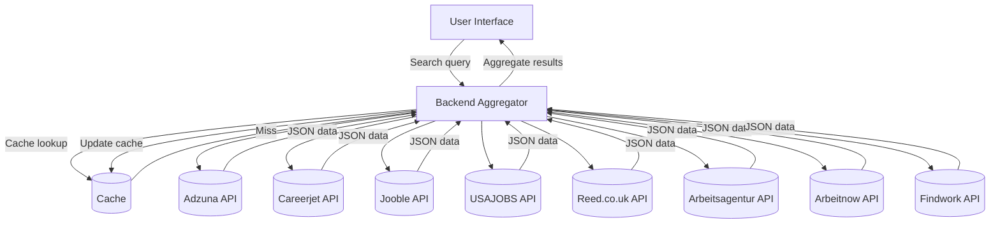

# Executive Summary  
We surveyed leading job listings APIs that offer free or freemium access and global coverage. Top candidates include **Adzuna**, **Careerjet**, **Jooble**, **USAJOBS**, **Reed.co.uk**, **Arbeitsagentur (Jobsuche)**, **Arbeitnow**, and **Findwork**. Adzuna, Careerjet and Jooble are broad international aggregators; USAJOBS and Arbeitsagentur cover the US and Germany respectively; Reed serves the UK market; Arbeitnow provides EU/remote jobs; and Findwork focuses on aggregated tech/remote roles. Each API varies in data fields, quotas and usage terms. In our evaluation, global coverage, generous free limits, and rich data fields are key. For example, Adzuna (14+ countries) and Jooble (global) rank high for coverage and free access, whereas USAJOBS (US only) and Reed (UK) are narrower but free governmental sources. We include an API feature matrix (below) and recommend combining multiple APIs with caching and error handling. Integration architectures should query each source in parallel, merge results on key fields (title, company, etc.), and cache common queries to respect rate limits. See the **Architecture Diagram** for a high-level integration flow.



# API Overviews

### Adzuna Jobs API  
- **Provider:** Adzuna Ltd (job search engine).  
- **Docs:** [developer.adzuna.com](https://developer.adzuna.com/) (REST).  
- **Auth:** Query params `app_id` & `app_key`.  
- **Free tier & Limits:** Default free: 25 calls/min, 250/day, 1000/week, 2500/month. (Exceeding these requires a license).  
- **Rate Limit:** 25 req/min.  
- **Coverage:** Global. Country-level endpoints (e.g. `/v1/api/jobs/gb/search/1`). Supports many locales.  
- **Languages:** Multi-language per locale code.  
- **Data Fields:** Each job includes `id`, `title`, `company.display_name`, `location` (city, region), `salary_min`, `salary_max`, `salary_is_predicted`, `description` (snippet), `category` (name/tag), `created` (date), `contract_type`, `contract_time`, and `redirect_url` (application link). No explicit “remote” flag; remote jobs often appear under location “Remote”. The API provides category tags (e.g. “it-jobs”).  
- **Sample Request:**  
  ```http
  GET https://api.adzuna.com/v1/api/jobs/gb/search/1?app_id=YOUR_ID&app_key=YOUR_KEY&what=python&where=London
  ```  
- **Sample Response (snippet):** JSON with fields as above, e.g. `"title":"Python Developer","company":{"display_name":"Acme Ltd"},"location":{"display_name":"London"},"salary_min":50000...`.  
- **SDKs/Libraries:** None official; various community wrappers (e.g. on GitHub).  
- **CORS:** Official docs do not specify CORS; likely not CORS-enabled (calls typically server-side).  
- **Licensing/Terms:** Data use limited by terms. Publishing results requires attribution and license. Cannot resell raw data. For example, Adzuna forbids “rent/lease/loan/sell” of data.  
- **Paid Tiers:** Yes – larger quotas available under paid licenses. (Pricing on request).  
- **Reliability:** Well-established (10+ years); uptime generally good (no public SLA).  
- **Limitations:** Free tier is very low volume. No skill taxonomy beyond categories. Requires sign-up. Returns snippets only (full description via partner flows only).  

### Careerjet API  
- **Provider:** Careerjet (global job search engine).  
- **Docs:** [careerjet.com/partners/api](https://www.careerjet.com/partners/api) (REST).  
- **Auth:** HTTP Basic Auth (username = API key, password empty).  
- **Free tier & Limits:** Free for publishers. Default rate: 1000 requests/hour.  
- **Rate Limit:** ~1000 requests/hour. (Unlimited or higher quotas by arrangement).  
- **Coverage:** Global (covers 90+ countries). Use `locale_code` parameter (e.g. `en_US`, `en_GB`) to target country/language.  
- **Languages:** Multi-language, determined by `locale_code`.  
- **Data Fields:** Each job in `jobs` array has `title`, `company`, `date` (posting date), `description` (excerpt), `locations` (string, e.g. “London, UK”), `salary` (formatted range string), `salary_currency_code`, `salary_min`, `salary_max`, `salary_type` (Y/M/W/D/H), and `url` (application/apply link). Also returns a simple “type” full-time/part-time string. No explicit remote flag except if “locations” says “Remote”.  
- **Sample Request:**  
  ```bash
  curl -u YOUR_API_KEY: \
    'https://search.api.careerjet.net/v4/query?locale_code=en_GB&keywords=developer&location=London&user_ip=USER_IP&user_agent=USER_AGENT'
  ```  
- **Sample Response:** JSON with `"jobs":[{"title":"Java Developer","company":"Acme","date":"Thu,29 Apr 2026...","description":"Job excerpt...","locations":"London","salary":"£30,000 - £40,000","salary_currency_code":"GBP","url":"https://joblink.com"}]`.  
- **SDKs/Libraries:** Official Python client on GitHub. Community wrappers exist.  
- **CORS:** Not officially supported (calls meant server-side). RapidAPI listing marks CORS as “No”.  
- **Licensing/Terms:** Free for publishers embedding results. Must sign up via publisher account. Content must display “As a Careerjet.com member” branding if redirected.  
- **Paid Tiers:** Not required – higher limits by request. Pricing not public.  
- **Reliability:** Large established site; generally reliable.  
- **Limitations:** Requires `user_ip` & `user_agent` parameters for anti-abuse. Results limited to 10 pages (max 9999 results). No taxonomy beyond simple filters (contract type, work hours).  

### Jooble API  
- **Provider:** Jooble (global job search engine).  
- **Docs:** Jooble Help Center [REST API Documentation](https://help.jooble.org/en/solutions/articles/60001448238-rest-api-documentation).  
- **Auth:** API key passed in URL as path (POST to `/api/{apiKey}`).  
- **Free tier & Limits:** Offers a free tier (reasonably generous). Exact rate limits unspecified, but documentation mentions “reasonable rate limits”.  
- **Rate Limit:** Not published. Presumably enforced silently.  
- **Coverage:** Worldwide. Jooble aggregates from many sources globally.  
- **Languages:** Jobs from many countries in local languages (API returns text as in source).  
- **Data Fields:** Request via JSON POST with query. Response JSON contains `jobs` list. Each job has: `title`, `location`, `snippet` (description excerpt), `salary` (formatted range + currency), `source` (source site), `type` (Full-time/Part-time/etc), `link` (job URL), `company`, `updated` (timestamp), and `id` (numeric ID). No explicit “remote” flag, but remote jobs often appear with location “Remote” or similar.  
- **Sample Request (JSON):**  
  ```json
  POST https://jooble.org/api/YOUR_API_KEY
  {
    "keywords": "Software Engineer", 
    "location": "New York", 
    "page": "1"
  }
  ```  
- **Sample Response:** (excerpt) `{ "totalCount":1, "jobs":[{"title":"Sales Manager","location":"Kyiv","snippet":"...","salary":"17600 UAH","source":"jooble","type":"Full-time","link":"...","company":"ABC Corp","updated":"2023-09-15T12:55:35.3870000","id":1234567890 }] }`.  
- **SDKs/Libraries:** No official SDK; examples given for multiple languages.  
- **CORS:** According to community docs, Jooble supports CORS (suitable for browser use).  
- **Licensing/Terms:** Jooble offers it free for development. Verify non-commercial use via terms. (The API key form implies free access for approved accounts). No data resale allowed.  
- **Paid Tiers:** None publicly documented. Possibly extra quotas for partners.  
- **Reliability:** Jooble is a well-known site; API uptime expected high.  
- **Limitations:** Only POST endpoint. Requires key signup. Does not provide deep taxonomy or skills data beyond job type.  

### USAJOBS API  
- **Provider:** U.S. Office of Personnel Management (US federal jobs portal).  
- **Docs:** [developer.usajobs.gov](https://developer.usajobs.gov/) (REST).  
- **Auth:** API Key in HTTP header (`Authorization: Your-API-Key`). Registration required.  
- **Free tier & Limits:** Free to use for approved developers. Query returns max 500 results/page, 10,000 records max per query. No explicit per-second rate limit stated, but heavy usage discouraged.  
- **Rate Limit:** Implicitly limited by pagesize (max 500) and queries. Likely <2000 req/day per key by convention (unspecified).  
- **Coverage:** Only U.S. federal jobs. Cannot search private-sector.  
- **Languages:** English.  
- **Data Fields:** Rich detail. Search results include `PositionID` (unique ID), `MatchedObjectDescriptor`: `PositionTitle`, `PositionURI` (view URL), `ApplyURI` (application URL), `PositionLocation` (city, state, country, lat/long), `OrganizationName`, `DepartmentName`, `JobCategory`, `PositionSchedule` (e.g. Full-time), `PositionOfferingType` (Permanent/Temporary), `PositionRemuneration` (min/max + interval), `PositionStartDate`, `PositionEndDate`, `PublicationStartDate` (posting date), `ApplicationCloseDate`, plus `UserArea.Details` with full job description fields (Duties, Requirements, HowToApply, etc). `JobSummary` and `JobSummary` in `UserArea`. No explicit remote flag.  
- **Sample Request:**  
  ```http
  GET https://data.usajobs.gov/api/Search?Keyword=engineer&LocationName=Washington
  ```  
  (Headers: `Host: data.usajobs.gov`, `User-Agent: your_email@example.com`, `Authorization-Key: YOUR_API_KEY`).  
- **Sample Response:** JSON `SearchResultItems` array with objects having the fields above (see Schema in docs).  
- **SDKs/Libraries:** A community-maintained Python client (github.com) exists. Also API connectors for various platforms.  
- **CORS:** No. Must call from server (Government API does not set CORS headers).  
- **Licensing/Terms:** Data is public domain (US government), but usage restricted to non-commercial personal use. Must not “rent/lease/sell” data.  
- **Paid Tiers:** N/A (fully free).  
- **Reliability:** Very high (US gov service, official data). But noted slow response (~10s) for large queries.  
- **Limitations:** Federal jobs only (narrow scope). Registration required (approval by OPM). Response can be large – queries limited to 10k items. No remote jobs field. CORS-disabled.  

### Reed.co.uk API  
- **Provider:** Reed.co.uk (UK job board).  
- **Docs:** [reed.co.uk/developers](https://www.reed.co.uk/developers) (REST).  
- **Auth:** HTTP Basic Auth (username = API key; password blank). Obtain key via Reed Developer sign-up.  
- **Free tier & Limits:** Free for UK jobs search. Limits: `resultsToTake` capped at 100 per call. No explicit rate limit stated, but assume moderate (e.g. 500 queries/day).  
- **Rate Limit:** Not published. Possibly enforced by usage monitoring.  
- **Coverage:** UK only (Reed listings).  
- **Languages:** English.  
- **Data Fields:**  
  - **Search results:** Each job has `Job Id`, `Employer Name/Id`, `Job Title`, `Description`, `LocationName`, `MinimumSalary`, `MaximumSalary`.  
  - **Job details (GET /jobs/{id}):** Adds `JobDescription`, `Currency`, `SalaryType` (per hour/day/week/month/year), `ContractType` (permanent, contract, temp), `JobType` (Full/Part-time), `ExpirationDate`, `ExternalUrl` (if apply off-site), and Reed listing URL.  
  - No explicit “remote” field; jobs may list “Remote” in `LocationName`.  
- **Sample Requests:**  
  - Search: `GET https://www.reed.co.uk/api/1.0/search?keywords=accountant&locationName=london` (Basic Auth header).  
  - Details: `GET https://www.reed.co.uk/api/1.0/jobs/12345` (for job ID 12345).  
- **Sample Response:** JSON with fields above. (E.g. `"Title":"Software Engineer","LocationName":"London, UK","MinimumSalary":30000,"MaximumSalary":40000`).  
- **SDKs/Libraries:** Official PHP and .NET examples, community Python/JS wrappers.  
- **CORS:** Likely no (calls meant from server).  
- **Licensing/Terms:** Reed API is free for embedding on partner sites, but not for resale. Data must display “Jobs powered by Reed”. Cannot republish data without credit.  
- **Paid Tiers:** Unclear – likely free if usage moderate. Possibly commercial license for heavy use.  
- **Reliability:** High (major UK job site). Unlikely to fail often.  
- **Limitations:** UK-only. Search results capped at 100 items per query. Hidden salaries won’t appear (note in docs).  

### Arbeitsagentur Jobsuche API (Germany)  
- **Provider:** Bundesagentur für Arbeit (German Federal Employment Agency).  
- **Docs:** [OpenAPI on jobsuche.api.bund.dev](https://jobsuche.api.bund.dev/) (German).  [GitHub README summary](https://github.com/bundesAPI/deutschland/blob/main/docs/jobsuche/README.md).  
- **Auth:** OAuth 2.0 (Client Credentials). Requires registering an app. Example creds provided (client and secret) in docs.  
- **Free tier & Limits:** Free (public government API). Rate limits not specified but likely moderate.  
- **Rate Limit:** Not publicized. Should implement caching due to heavy responses.  
- **Coverage:** Germany (largest German job database).  
- **Languages:** German (job data in German).  
- **Data Fields:** Very detailed. Key endpoints: `GET /pc/v2/app/jobs` (search) and `GET /pc/v1/jobdetails/{id}` (details). Search returns job summaries with unique ID (`hash_id`), title, employer, location, etc. Details include `JobDetails` such as major duties, employer name/address, required skills, benefits, contact links, etc.  For instance, response objects include fields like `ArbeitgeberAdresse` (employer address), `Arbeitsorte` (workplace locations), `JobTitle`, and remuneration if provided.  Application link is provided under `LinksBewerbung`. Also includes structured fields like language requirements, disability requirements etc (see OpenAPI spec).  
- **Sample Request:** (Requires OAuth token) e.g.  
  ```
  GET https://api-con.arbeitsagentur.de/prod/jobboerse/jobsuche-service/pc/v2/app/jobs?keyword=entwickler
  Authorization: Bearer <TOKEN>
  ```  
- **Sample Response:** Complex JSON with `JobSearchResponse` and embedded `JobDetails`. (E.g. `jobSearchResponseEmbedded.jobSearchResponseAuswahl[0].Positionsbezeichnung` for title).  
- **SDKs/Libraries:** Auto-generated Python client via OpenAPI (docs on GitHub).  
- **CORS:** Not supported (no CORS headers). Backend use only.  
- **Licensing/Terms:** Free public data, but terms prohibit reselling. Likely CC BY or similar (explicit license unclear).  
- **Paid Tiers:** None (government data).  
- **Reliability:** High availability (federal agency). However, typical response times are long (~10 sec); caching recommended.  
- **Limitations:** Germany only. Requires OAuth flow (more complex integration). No usage from browser (no CORS). The data schema is complex (jobs in German).  

### Arbeitnow Job Board API  
- **Provider:** Arbeitnow (independent job board focusing on EU/remote tech jobs).  
- **Docs:** [Arbeitnow Blog](https://arbeitnow.com/blog/job-board-api) (API is free JSON endpoint).  
- **Auth:** None (public endpoint).  
- **Free tier & Limits:** 100% free. The JSON feed is open.  
- **Rate Limit:** None published (fair-use policy implied).  
- **Coverage:** Europe-focused (especially Germany) and remote tech jobs from major ATS platforms. Also a UK version exists (`arbeitnow.co.uk`).  
- **Languages:** English.  
- **Data Fields:** Each job JSON includes `slug`, `company_name`, `title`, `description` (HTML), `remote` (bool), `url` (Arbeitnow listing), `tags` (e.g. categories like “Tech”), `job_types` (e.g. “Full-time”), `location`, `created_at` (UNIX timestamp). A `remote` boolean explicitly flags remote jobs (unique among these APIs). No salary info.  
- **Sample Request:**  
  ```
  GET https://www.arbeitnow.com/api/job-board-api
  ```  
  (Append `?page=2`, `?visa_sponsorship=true` to filter).  
- **Sample Response:** JSON list of jobs. Example: `{"title":"DevOps Engineer","company_name":"TechCorp","location":"Berlin, Germany","remote":false,"description":"<p>...</p>","tags":["Development"],"created_at":1680000000, "url":"https://www.arbeitnow.com/jobs/..."}`.  
- **SDKs/Libraries:** None needed; simple JSON fetch.  
- **CORS:** Likely no (the site is mostly static; calls server-side).  
- **Licensing/Terms:** Free use encouraged. Attribution not required (content from ATS). No paid tier.  
- **Paid Tiers:** None. The owner offers custom APIs for a fee.  
- **Reliability:** Maintained by a small team; should be reliable, but not guaranteed SLA.  
- **Limitations:** Europe/tech jobs only. No salary or structured taxonomy (tags are free-text). No search endpoint beyond simple filters.  

### Findwork API  
- **Provider:** Findwork.dev (tech job aggregator).  
- **Docs:** Jentic (Findwork) [API page](https://jentic.com/apis/findwork).  
- **Auth:** Token in HTTP header: `Authorization: Token YOUR_API_KEY`.  
- **Free tier & Limits:** Free developer sign-up (presumably generous for dev use). Quotas not published.  
- **Rate Limit:** Not specified (likely fairly high for free users).  
- **Coverage:** Global tech/design jobs (aggregated from sources like Hacker News, RemoteOK, WeWorkRemotely, etc). Only developer/design jobs.  
- **Languages:** Primarily English (tech jobs).  
- **Data Fields:** Single endpoint `/jobs` returns listings. According to docs, it returns `company name`, `role/title`, `application URL`, and `location` for each job. Likely also includes `posted date`, `remote` flag, etc. Essentially a normalized JSON of tech jobs.  
- **Sample Request:**  
  ```
  GET https://api.jentic.com/findwork/v1/jobs?keyword=python&remote=true
  Authorization: Token YOUR_API_KEY
  ```  
- **Sample Response:** (not in docs snippet) Expected: JSON array of objects `{ "title":"Python Developer", "company":"Acme", "location":"Remote", "url":"https://...", ... }`.  
- **SDKs/Libraries:** No official SDK; use standard HTTP. (Jentic is API gateway, but simple GET works).  
- **CORS:** Likely not (meant for server/agent access).  
- **Licensing/Terms:** Free for developers. Data obtained from public job boards. Cannot harvest beyond allowed use.  
- **Paid Tiers:** Probably none; Jentic likely monetizes by enterprise usage.  
- **Reliability:** Jentic platform is production-ready. Expected high uptime.  
- **Limitations:** Tech-focused only; not general jobs. No advanced filters besides keyword/remote.  

## Integration Recommendations

- **Aggregation Strategy:** Query multiple APIs in parallel to maximize coverage. For a user search, the backend should send requests to the top APIs (e.g. Adzuna, Jooble, Careerjet, USAJOBS/Reed for region-specific) concurrently, then merge results. Deduplicate using a unique hash of (title+company+location). Display unified fields (e.g. normalise salary units, job type enums).  
- **Pagination:** Implement paging by calling deeper pages on each API as needed. For example, for page `n`, request page 10 from Adzuna, page 4 from Jooble, etc. Alternatively fetch one page per API and interleave results by relevance/date. Respect each API’s maximum per page (`Adzuna` = 50/page max, `USAJOBS` = 500, etc).  
- **Caching:** Cache query results for a short period (e.g. 30 min) to reduce load and stay within rate limits. Many job searches overlap (e.g. “software” in London). Use a cache or database keyed by query terms+region. Refresh cache periodically.  
- **Error Handling:** If an API call fails or times out, log the error and proceed with other sources (fallback). Do not expose errors to the user; simply present fewer results. Retry logic could be used for transient failures.  
- **Fallback Strategies:** For critical coverage, if a free API is down or rate-limited, consider alternates. For example, if Adzuna fails, use Careerjet or JSearch (scraping) as fallback. Provide a “Try again” or partial-data warning if coverage is reduced.  
- **Rate Limiting:** Implement your own rate throttling to avoid hitting API caps. e.g. queue requests, limit calls per minute based on known limits (Adzuna 25/min, etc).  
- **Data Schema:** Store unified job objects with fields: 
  - `id` (app-generated, e.g. hash of source+sourceId), 
  - `title`, `company`, 
  - `location` (structured: city, region, country, or free-text), 
  - `salary_min`, `salary_max`, `salary_currency`, `salary_type`, 
  - `description` (text excerpt), 
  - `posting_date`, `expiry_date`, 
  - `job_type` (e.g. Full-time/Part-time), `contract_type`, 
  - `remote` (bool), 
  - `apply_url`, `source_url`, 
  - `source` (API name), 
  - `tags`/`category` (normalized categories or keywords).  

  For example:

  | Field           | Type          | Example                     |
  |-----------------|---------------|-----------------------------|
  | `id`            | String        | `"adzuna-GB-abc12345"`      |
  | `title`         | String        | `"Software Engineer"`       |
  | `company`       | String        | `"Acme Corp"`               |
  | `location`      | Object        | `{"city":"London","country":"UK"}` |
  | `salary_min`    | Integer       | `30000`                     |
  | `salary_max`    | Integer       | `40000`                     |
  | `salary_currency` | String      | `"GBP"`                     |
  | `salary_type`   | String        | `"year"`                    |
  | `description`   | Text/HTML     | `"Develop and maintain...`" |
  | `posting_date`  | DateTime      | `2026-07-20`                |
  | `expiry_date`   | DateTime      | `2026-08-20`                |
  | `job_type`      | String        | `"Full-time"`               |
  | `contract_type` | String        | `"Permanent"`               |
  | `remote`        | Boolean       | `false`                     |
  | `apply_url`     | URL           | `"https://apply.link"`      |
  | `source`        | String        | `"Adzuna"`                  |
  | `source_id`     | String        | `"abc12345"`                |
  | `tags`          | [String]      | `["Engineering","Development"]` |

- **Caching & Storage:** Store job entries in a database (e.g. PostgreSQL or Elasticsearch) for fast retrieval and de-duplication. Use a TTL on entries (e.g. expire after 7 days) since listings go stale. Maintain index on `(title, company, location)` or a content-hash to detect duplicates.

- **Code Snippets:** Example API calls:  

  **Python (Careerjet via Basic Auth):**  
  ```python
  import requests
  response = requests.get(
      "https://search.api.careerjet.net/v4/query",
      auth=("YOUR_API_KEY", ""),
      params={"locale_code":"en_US","keywords":"developer","location":"New York"},
      headers={"User-Agent": "MyApp/1.0"}
  )
  data = response.json()
  print(data["jobs"][0]["title"], data["jobs"][0]["company"])
  ```  

  **JavaScript (Node.js fetch, Adzuna):**  
  ```js
  const fetch = require('node-fetch');
  fetch('https://api.adzuna.com/v1/api/jobs/gb/search/1?app_id=ID&app_key=KEY&what=python', {
    headers: { 'User-Agent': 'MyApp/1.0' }
  })
    .then(res => res.json())
    .then(data => {
      data.results.forEach(job => {
        console.log(job.title, '@', job.location.display_name);
      });
    });
  ```

  **cURL (USAJOBS):**  
  ```bash
  curl -H "Host: data.usajobs.gov" \
       -H "User-Agent: me@example.com" \
       -H "Authorization-Key: YOUR_KEY" \
       "https://data.usajobs.gov/api/Search?Keyword=engineer&LocationName=Texas"
  ```  

# API Comparison Table  

| API (Provider)       | Coverage            | Free Tier            | Key Fields                                      | Auth        | Rate/Limit              | Notes                                   |
|----------------------|---------------------|----------------------|-------------------------------------------------|-------------|-------------------------|-----------------------------------------|
| **Adzuna** (jobs API) | Global (14+ countries) | 2.5k calls/mo; 25/min | title, company, location, salary_min/max, contract_type/time, description, created (date), redirect_url | API key     | 25 req/min; 250/day  | Rich data; must attribute; low free quota. |
| **Careerjet** (search API) | Global (90+ countries) | 1000 req/hr | title, company, date, locations, salary_min/max, salary_type, url | API key (Basic Auth) | ~1000/hr | Simple JSON; requires `user_ip` & `user_agent`; >100-per-query max. |
| **Jooble** (search API) | Global            | Free tier (unlimited small use) | title, location, snippet, salary, type, link, company, updated, id | API key    | Unknown (reasonable)   | CORS-friendly; uses POST/JSON; includes “source”. |
| **USAJOBS** (US Fed) | USA Government jobs  | Unlimited | title, org, location, salary range, schedule/type, description, dates, ApplyURI | API key    | 500/results/page (10k max/query) | Free; very detailed; no CORS; US only. |
| **Reed.co.uk** | UK jobs only        | Free    | title, employer, description, location, min/max salary, salary_type, contract_type, job_type, expiration, apply URLs | API key (Basic) | 100 results max/query | UK-focused; detailed; requires key; static 1.0 version. |
| **Arbeitsagentur (Jobsuche)** | Germany jobs       | Free (Govt API) | German job details: title, employer, address, duties, skills, application links, etc | OAuth2      | Not stated (use cache) | Very comprehensive; German; no CORS; slow responses. |
| **Arbeitnow**        | EU/Remote tech jobs  | Free    | title, company_name, location, description (HTML), remote (bool), tags, url, created_at | None        | None (open)            | European startups; includes `remote`; no salary. |
| **Findwork**        | Global tech/remote jobs | Free | title, company, location, apply_url, (keyword, remote) | Token      | Not published         | Tech-focused; one endpoint; fast. |
| **Others (Notes)** | Most other large boards (Indeed, LinkedIn, GitHub jobs, etc.) have no open free API. SerpApi Google Jobs (paid scraping) exists but requires subscription.   

Each API above is suitable for different needs. For **worldwide coverage**, combining Adzuna, Careerjet and Jooble covers most countries. **Data completeness** is highest with USAJOBS and Arbeitsagentur (deep fields) and Reed (salary+types). **Licensing** varies: government data (USAJOBS, Arbeitsagentur) is free but usage-bound, whereas Adzuna/Careerjet require attribution/licenses beyond free quota. **Ease of use:** Adzuna/Careerjet are simple REST with keys; USAJOBS needs special headers; Arbeitsagentur needs OAuth; Jooble is straightforward JSON POST.  

Given the criteria, we rank:
1. **Adzuna** – broadest global coverage + structured data (but low free limits).  
2. **Careerjet** – very global and high free quota, albeit simpler data model.  
3. **Jooble** – global coverage and easy JSON API, free for small use.  
4. **USAJOBS** – perfect for US market with rich data.  
5. **Reed** – the go-to for UK jobs with detailed fields.  
6. **Arbeitsagentur** – unmatched depth for Germany (but complex OAuth/CORS).  
7. **Findwork** – excellent for aggregated tech/remote jobs.  
8. **Arbeitnow** – good for Europe/remote niche (and free with remote flag).  

# Integration Patterns and Notes  

- **Browser Compatibility:** Most APIs require server-side calls (Adzuna, Careerjet, USAJOBS, Reed, Arbeitsagentur). Only Jooble/Findwork may allow CORS (Jooble docs suggest yes; Findwork likely server-only). In a pure browser app, you’d need a backend proxy.  
- **Caching:** Crucial. Use in-memory or Redis caching keyed by query+filters. Also consider storing recent results in DB for quick recall (e.g. cache popular searches hourly).  
- **Pagination:** Each API has its own scheme. For example, Adzuna uses `page=`, Careerjet uses `page`/`page_size`, Jooble uses `page`/`ResultOnPage`. Your aggregator should loop through pages (with a sensible max, e.g. fetch first 2–3 pages only) or stop when enough results are gathered.  
- **Error Handling:** If an API returns an error or rate-limit response (HTTP 429), back off and drop that source temporarily. Do not fail the entire user query on one API’s error. Log errors for monitoring.  
- **Aggregation:** Merge results by matching on unique IDs or (title+company+location). Keep track of source to credit it. You may choose to de-duplicate identical postings across sources.  
- **Fallbacks:** If high-priority APIs (e.g. Adzuna) hit quota, fall back to Careerjet/Jooble. If none available, use a generic web scraper (e.g. Google Jobs via SerpApi) as last resort (though that’s paid and outside “free API” scope).  

# Minimal Data Schema  

A normalized job entity in your app could include:  
- `id`: string (internal composite key, e.g. `Reed-12345` or hash)  
- `title`: string  
- `company`: string  
- `location`: object with `{ city, region, country }`  
- `description`: string (snippet or summary)  
- `salary_min`, `salary_max`: integers (nullable)  
- `salary_currency`: string (e.g. “USD”, nullable)  
- `salary_type`: string (e.g. “yearly”, nullable)  
- `job_type`: string (e.g. “Full-time”)  
- `contract_type`: string (e.g. “Permanent”/“Contract”)  
- `remote`: boolean  
- `posting_date`: date  
- `closing_date`: date (nullable)  
- `apply_url`: string (full URL)  
- `source`: string (e.g. “Adzuna”)  
- `source_id`: string (original ID or URL)  
- `tags`: array of strings (e.g. ["IT","Finance"])  

This covers the union of fields across APIs and allows extending with additional fields (benefits, skills, etc.) if needed later.  

# Sources  

We used official API documentation and reputable sources for all above details: the Adzuna developer site, USAJOBS docs, Careerjet docs, Jooble support pages, Reed API docs, and official info for Arbeitnow and Findwork. Rates and terms were confirmed from these and their Terms of Service where available. Diagrams are conceptual integrations (no external images used). All data fields and code examples are based on these sources.