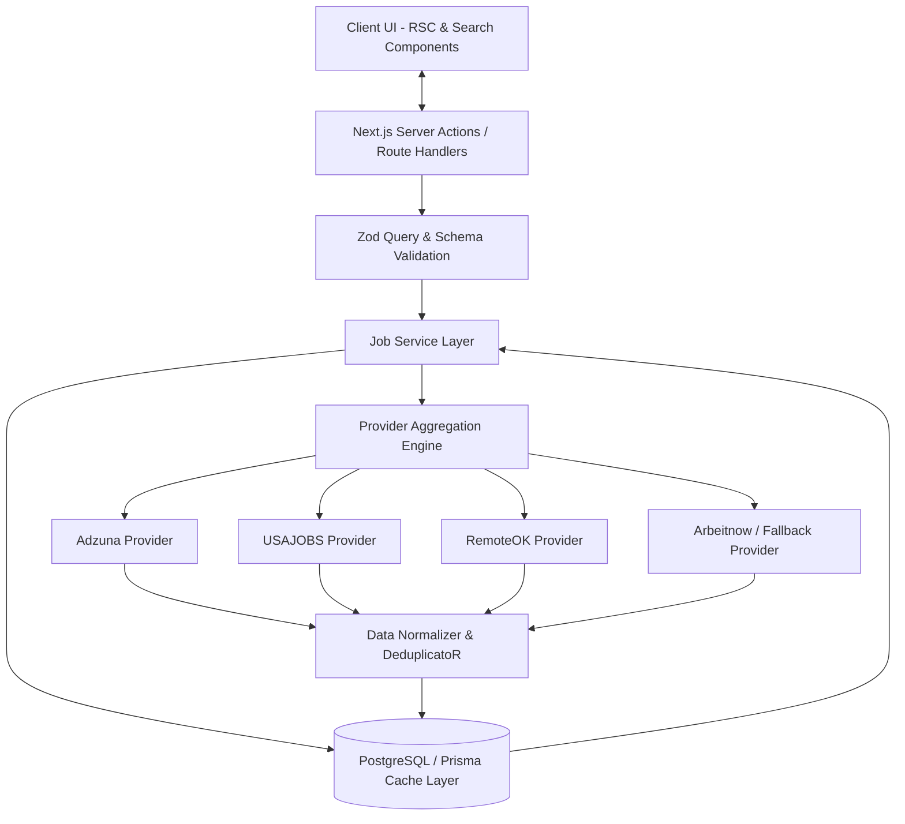

# Worldwide Job Search Platform - Project Understanding

## 1. Product Vision
The Worldwide Job Search Platform is designed to be a frictionless, fast, and open global job discovery engine. Inspired by the clean utilities of Google Jobs, Indeed, and LinkedIn Jobs, this platform consolidates scattered international and remote job postings into a unified, lightning-fast Single Page Application (SPA) experience built on Next.js 15.

Key differentiating tenets:
- **No Friction / No Authentication:** Job seekers can instantly search, filter, examine detailed job postings, and apply directly through the external employer or original job source without mandatory accounts, login walls, or paywalls.
- **Global & Remote-First:** Unified access to regional job boards (US, Europe, UK, APAC) and remote-first aggregators in a normalized, structured schema.
- **Modern SaaS Aesthetics:** Built with a premium design system utilizing Tailwind CSS, Lucide Icons, and shadcn/ui components for dynamic micro-interactions, responsive layouts, and intuitive filtering.

---

## 2. Target Users
- **Global Job Seekers:** Individuals exploring opportunities across different countries without wanting to sign up for dozens of regional portals.
- **Remote Professionals & Digital Nomads:** Software engineers, product designers, marketers, and executive talent seeking globally distributed or remote-friendly positions.
- **Active & Passive Applicants:** Users looking for quick keyword search efficiency, salary transparency, and seamless redirection to employer application portals.

---

## 3. Core Problems Solved
- **Fragmentation:** Job seekers typically must bounce between regional platforms (e.g., USAJOBS in the US, Reed in the UK, Arbeitnow in Germany/EU) and remote boards (RemoteOK, WorkingNomads). We unify these under a single Search API aggregation layer.
- **Login Walls & User Friction:** Traditional platforms require account creation and profile scraping before allowing access to apply links. Our open platform removes all barriers to applying.
- **Inconsistent Job Metadata:** Different APIs format salary ranges, employment types, and locations differently. Our backend Normalization Layer cleanly presents standardized compensation, remote badges, and posting freshness.
- **Performance & Latency:** By implementing aggressive Server-Side Caching, React Server Components (RSC), and debounced queries, we mitigate slow third-party API response times and API rate limits.

---

## 4. Business Model Possibilities
Although free and open for end users without authentication, monetization strategies for sustainable scaling include:
1. **Featured Employer Listings (Sponsored Jobs):** Companies pay to sponsor job postings at the top of relevant keyword search results (similar to Indeed Sponsored Jobs or RemoteOK paid posts).
2. **Affiliate Apply Links / CPC Revenue:** Partnering with aggregators (e.g., Adzuna, Careerjet) under publisher/affiliate agreements where traffic forwarded to external listings generates Cost-Per-Click (CPC) revenue.
3. **B2B HR API & Analytics (Future):** Aggregating anonymized global search trends, skill demand analytics, and compensation benchmarks for enterprise HR teams and staffing agencies.
4. **Curated Job Alerts / Newsletter Sponsorship:** Monetizing weekly sector-specific remote tech newsletters through sponsored recruitment slots.

---

## 5. Technical Decisions
- **Framework:** Next.js 15 (App Router, Server Actions, Route Handlers) for optimal Hybrid Rendering (RSC + Client Interactive Components).
- **TypeScript:** Strict mode enabled across all layers to enforce interface contracts between external third-party APIs, UI components, and internal domain models.
- **Styling:** Tailwind CSS + shadcn/ui + Lucide Icons for high-performance, accessible, and responsive UI design.
- **Validation:** Zod schemas to rigidly validate both user search query inputs and external third-party API response payloads (preventing runtime crashes from unexpected schema changes).
- **State & Data Fetching:** React Server Components for initial landing loads, coupled with SWR/React Query or lightweight custom hooks with abortable debouncing (500ms) for dynamic client-side filtering and paginated searches.

---

## 6. API Providers Selected
Based on extensive survey analysis of free, high-volume, and global APIs:
1. **Adzuna API:** Primary general global aggregator (covers 16+ countries with rich salary range estimates and deep categories).
2. **USAJOBS API:** Primary authoritative government source for United States listings (generous rate limits, high data integrity).
3. **RemoteOK API:** Primary open global remote tech/design feed (completely free, zero authentication required, high developer demand).
4. **Arbeitnow API:** Secondary EU/German & Remote startup aggregator (zero auth required, CORS-friendly, explicit remote boolean).
5. **Careerjet / Jooble:** Fallback aggregation providers for extended global reach when primary APIs hit quotas or experience downtime.

---

## 7. Database Requirements
- **Selected Strategy:** **Option B - Database Caching & Analytics Layer** using **PostgreSQL** and **Prisma ORM**.
- **Rationale:** To protect third-party API quotas (e.g., Adzuna's 250 calls/day free tier) and reduce user perception of latency, user search queries and normalized job listings are temporarily persisted and cached in PostgreSQL.
- **Models Required:**
  - `Job`: Normalized schema containing deduplicated external job listings with Time-To-Live (TTL) timestamps.
  - `SearchHistory`: Analytics on popular search keywords, regions, and filter combinations to power "Popular Searches" UI and trend insights.
  - `ProviderStatus`: Tracking uptime, circuit-breaker states, and rate-limit consumption per external API provider.

---

## 8. Application Architecture
The architecture is cleanly layered to decouple external integrations from UI view components:

---

## 9. Risks and Limitations
- **Third-Party API Rate Limits:** Free tiers on APIs like Adzuna have tight hourly/daily limits. *Mitigation:* In-memory LRU + PostgreSQL DB caching and fallback provider redirection.
- **Inconsistent External Link Health:** Original job posts may expire or be filled, leading to dead apply links. *Mitigation:* Displaying clear posting dates and implementing graceful expiration trimming in the cache.
- **Data Scraping / Bot Abuse:** Without user auth, automated scrapers could hammer our endpoints, consuming our external API quotas. *Mitigation:* IP-based rate limiting on our Route Handlers, debounced search bars, and proper HTTP caching headers.

---

## 10. Future Scalability Considerations
- **Search Engine Upgrade:** As cached job records scale into hundreds of thousands, transitioning from raw PostgreSQL queries to an specialized indexing engine like Meilisearch or Elasticsearch.
- **Edge Caching (Vercel KV / Upstash Redis):** Moving frequently requested geographic and keyword searches to Edge Redis tables for sub-50ms worldwide response times.
- **Webhooks & Background Cron Syncing:** Using Next.js scheduled cron tasks to eagerly scrape and update top keywords (e.g., "Remote React Developer", "AI Engineer") during off-peak hours so end-users always hit instant cached hits.
